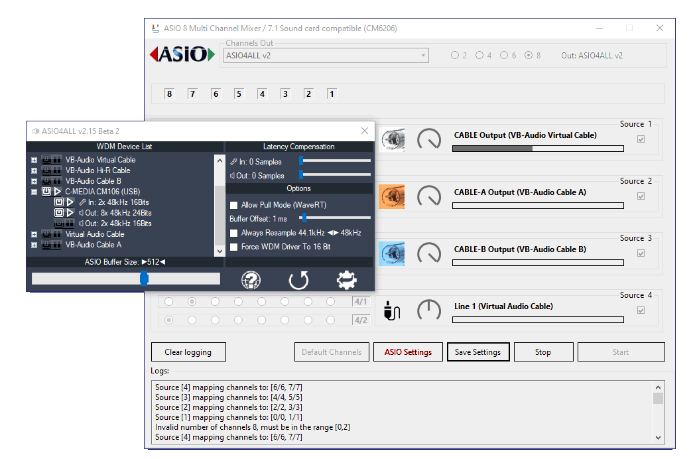

# Audio 7.1, 5.1 Multi Channel Mixer - 8 channels output

Audio 7.1 Multi Channel Mixer from 8 separate inputs to ASIO output. Support All USB 5.1, 7.1 Sound card. Tested on `cm6206` chips.

  

  
